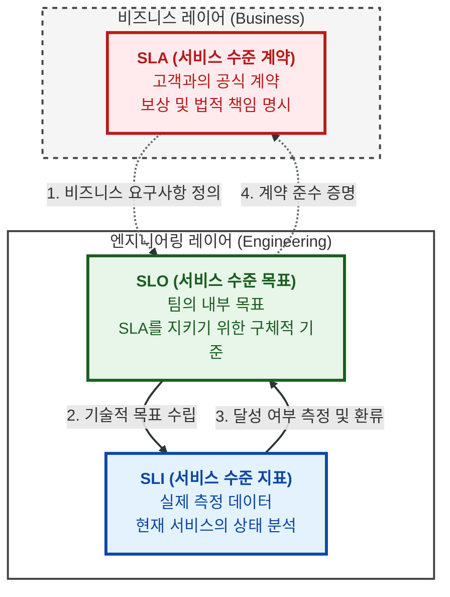

개발자로써 일을 하다보면 전문 용어를 꽤나 많이 쓰게됩니다. 저도 주니어 때 잘 못 알아들어서 꽤나 애를 먹었었죠. 양심고백하자면 지금도 간혹 못 알아듣습니다. 연차가 쌓였으니 지금은 그냥 아는 척 가만히 있다가 나중에 몰래 검색해서 지식의 빈 구멍을 채우고 있습니다. 영어로 된 비즈니스 용어가 여기에 해당할 거고, 그 밖에도 `판교사투리` 라는게 유명하죠. 판교에서 개발자로 열심히 일하면 `디벨롭 쪽은 어느 정도 얼라인 됐구요. 아직 개발팀 리소스 파악 중이라 지라에는 업데이트 못했는데, 슬랙으로 어제 말씀드렸던 것처럼 듀데잇 까지는 완성할 수 있을 것 같습니다.` 같은 인텔리 문장을 유창하게 구사하게 됩니다.

전문가의 영역에서는 아무래도 늘 있는 일이겠지요. 대표적으로 의학 용어가 있을 것 같은데요. 의학 드라마 같은 데서 "ACL 파열입니다.", "ROM 체크했니?" 뭐 이런 대화를 하겠죠! 우리 입장에서 들으면 Access List가 파열? Read Only Memor가 뭐 어째? 느낌인데요.. 의학용어로는 '전방십자인대 파열', '가동 범위 체크했니' 뜻이라고 합니다. 제가 즐겨봤던 유튜브 채널 중에 `이동훈 박사의 뼈있는 이야기`가 있는데, 이 글을 쓰다가 생각나서 오랜만에 들어가 봤더니 꽤 오래 운영한 이 채널 조회수 1위 영상이 여전히 의학용어풀이 입니다.

잡담이 길었는데요, 이런 용어들을 새로 듣게 되면 까먹지 않기 위해 정리해 두는게 좋겠다는 생각을 늘 합니다. 그런 의미에서 가끔씩 이렇게 블로그에 정리하는 것도 나쁘지 않을 것 같아요. 오늘은 그 중에서 `SLO`라는 용어를 소개해드려볼까 합니다.

서비스를 제공할 때는 긍정적인 사용자 경험을 만드는 것이 필수적이며, 이는 책임감에서 시작됩니다. 서비스 공급자로서 우리의 역할은 고객이 기대하는 수준의 서비스를 지속적으로 받을 수 있도록 보장하는 것입니다. 고객과 약속을 할 때는 성과를 측정하고 그 약속을 이행했는지 판단할 명확한 기준이 필요하죠.

이번 포스팅에서는 안정적인 서비스 운영의 핵심 지표인 **SLO(Service Level Objective)**가 무엇인지 알아보고, 흔히 혼동하기 쉬운 **SLA, SLI**와의 차이점을 정리해 보겠습니다.

## SLO(Service Level Objective)란 무엇인가?

서비스 수준 목표(SLO)는 제공하는 서비스가 고객의 기대를 충족하는지 확인하기 위해 설정하는 **내부 목표**입니다. SLO는 특정 기간 동안 서비스가 달성해야 하는 구체적인 목표 수치를 나타냅니다. SLO에는 메트릭, 목표 및 기간이라는 세 가지 주요 구성 요소가 있는데요, 각각을 간략히 설명하면 아래와 같습니다.

* **메트릭(Metric)**: 가동 상태, 대기 시간(Latency), 처리량(Throughput) 등 측정 가능한 수치입니다.
* **목표(Target)**: 달성하고자 하는 특정 숫자입니다 (예: 99.9%).
* **기간(Time Window)**: 메트릭을 측정하는 범위입니다 (예: 최근 30일).

예를 들어 "최근 30일 동안 가동 시간이 99.9% 이상이어야 한다"는 것은 아주 전형적인 SLO의 예시입니다.

## SLA, SLO, SLI: 이들의 관계와 차이점

SLO, SLA 및 SLI는 서로 밀접하게 연결되어 있지만, 그 목적과 대상에 분명한 차이가 있습니다.

### 1. SLA (Service Level Agreement, 서비스 수준 계약)

SLA는 공급자와 고객 간의 **비즈니스 계약**입니다. 서비스가 기대치에 미치지 못할 경우 발생할 수 있는 재정적 보상(크레딧 제공, 환불 등)이나 법적 책임을 명시합니다. 주로 법무 및 비즈니스 팀이 작성하며 외부 고객에 대한 공식적인 약속입니다.

### 2. SLO (Service Level Objective, 서비스 수준 목표)

SLO는 팀이 SLA를 준수하기 위해 내부에 설정하는 **성능 목표**입니다. 일반적으로 SLA보다 더 엄격하게 설정합니다. 예를 들어 SLA가 99.9%라면, SLO가 99.95%로 설정되어 팀이 선제적으로 대응할 수 있도록 합니다.

### 3. SLI (Service Level Indicator, 서비스 수준 지표)

SLI는 SLO를 얼마나 잘 준수하고 있는지 나타내는 **실제 측정 데이터**입니다. "현재 우리 서비스의 가동 시간은 99.92%이다"라고 말할 때, 이 99.92%가 바로 SLI입니다.

| 구분 | SLA | SLO | SLI |
| :---: | :---: | :---: | :---: |
| **의미** | 고객과의 비즈니스 계약 | 팀 내의 성과 목표 | 실제 측정된 값 |
| **주요 독자** | 외부 고객, 비즈니스 파트너 | 개발 및 엔지니어링 팀 | 개발 및 엔지니어링 팀 |
| **결과** | 미달 시 재정적/법적 보상 | 미달 시 우선순위 조정 및 대응 | 목표 달성 여부 판단 근거 |

## AWS 서비스로 보는 구체적인 예시

우리가 인프라에서 자주 사용하는 아마존 AWS 서비스를 기준으로 이 지표들을 대입해 보면 더 쉽게 이해할 수 있겠죠. 예를 들어 **Amazon S3**를 사용한다고 가정해 봅시다.

* **SLA**: AWS는 S3 표준 스토리지 클래스에 대해 **99.9%의 월간 가동 시간 비율**을 보장합니다. 만약 이 기준을 지키지 못하면 고객에게 사용 비용의 일부를 '서비스 크레딧'으로 환불해 줍니다.
* **SLO**: S3를 관리하는 AWS 엔지니어링 팀은 고객과의 약속(99.9%)을 안전하게 지키기 위해 내부적으로 **99.99% 가동 시간**을 목표로 설정할 수 있습니다.
* **SLI**: CloudWatch 등을 통해 실제로 측정된 **지난 30일간의 S3 가동률(예: 99.995%)**이 SLI가 됩니다.

또 다른 예로 **Amazon EC2**에서 가동 시간뿐만 아니라 '성능' 지표를 본다면 어떨까요?

* **SLA**: "인스턴스 가용성을 99.99% 보장한다."
* **SLO**: "API 응답 속도(Latency)가 P99 기준 200ms 이내여야 한다."
* **SLI**: "실제 측정된 지난 1시간 동안의 평균 API 응답 속도는 150ms이다."

## 오류 예산(Error Budget): 혁신과 안정성의 균형

SLO를 이야기할 때 빼놓을 수 없는 개념이 바로 **오류 예산(Error Budget)**입니다. 100% 가동 시간은 현실적으로 불가능하며, 비용 대비 효율도 떨어집니다. 오류 예산은 우리가 허용할 수 있는 불완전함의 정도를 의미합니다.

예를 들어 SLO가 99.9%라면, 0.1%의 오류 예산이 주어집니다. 팀은 이 예산 범위 내에서 새로운 기능을 배포하거나 시스템을 업데이트하는 '혁신'을 실험할 수 있습니다. 만약 오류 예산을 모두 소진했다면, 보안 패치나 인프라 안정화 작업 외의 새로운 배포는 멈추고 신뢰성을 높이는 데 집중해야 합니다.

## SRE와 SLO: 뗄래야 뗄 수 없는 관계

지금까지 SLO이 무엇인지 살펴봤습니다. 인터넷에서 서비스를 제공하는 조직이라면 잘 알고 관리해야 할 개념일 것 같은데요, 그렇다면 여기서 SRE 이야기를 한 번 해봐야 할 것 같습니다. 왜냐하면 이러한 목표를 좀 더 전문적으로 관리하는 조직이 존재하거든요. 큰 IT 기업의 채용 공고에서 종종 볼 수 있는 조직명이기도 합니다.

**SRE(Site Reliability Engineering, 사이트 신뢰성 엔지니어링)**는 구글에서 처음 정립한 개념으로, 간단히 말해 **"소프트웨어 엔지니어가 운영 작업을 수행하는 방식"**입니다. 시스템의 신뢰성을 유지하면서도 새로운 기능 배포의 속도를 늦추지 않는 것을 목표로 하죠.

여기서 **SLO**는 SRE 팀이 시스템의 신뢰성을 측정하고 관리하는 가장 핵심적인 도구가 됩니다. "신뢰할 수 있는 시스템인가?"라는 막연한 질문에 대해, SLO는 "99.9% 가동 중인가?"라는 구체적인 숫자로 답을 주기 때문입니다. 즉, SRE가 하나의 **철학이자 실천 방법**이라면, SLO는 그 철학을 실천하기 위한 **기준점**이라고 볼 수 있습니다.

## 결론: 왜 이러한 지표들이 중요한가?

SLO는 단순히 수치를 관리하는 것을 넘어 다음과 같은 가치를 제공합니다.

* **팀의 목표 정렬**: 개발, 운영, 비즈니스 팀이 '신뢰성'이라는 공통의 언어로 협업할 수 있습니다.
* **고객 경험 개선**: 문제가 고객에게 영향을 미치기 전에 식별하고 해결할 수 있는 기준이 됩니다.
* **의사결정의 근거**: 새로운 기능을 더 공격적으로 출시할지, 아니면 시스템 안정성에 투자해야 할지 데이터에 기반하여 결정할 수 있습니다.

안정적인 서비스를 구현하기 위해서는 우리 서비스의 중요한 SLI를 정의하고, 현실적이면서도 도전적인 SLO를 설정하는 것부터 시작해 보시길 바랍니다.

## Reference

* [https://namu.wiki/w/판교%20사투리](https://namu.wiki/w/판교%20사투리)
* [https://www.youtube.com/watch?v=3ziYg3Gv_bA](https://www.youtube.com/watch?v=3ziYg3Gv_bA)
* [https://www.atlassian.com/ko/incident-management/kpis/sla-vs-slo-vs-sli](https://www.atlassian.com/ko/incident-management/kpis/sla-vs-slo-vs-sli)
* [https://sre.google/sre-book/service-level-objectives/](https://sre.google/sre-book/service-level-objectives/)
* [https://en.wikipedia.org/wiki/Site_reliability_engineering](https://en.wikipedia.org/wiki/Site_reliability_engineering)