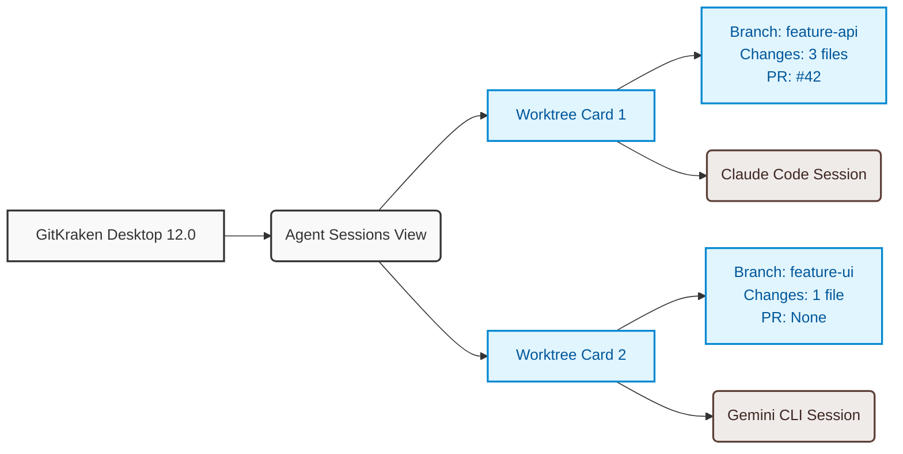

최근 소프트웨어 개발 생태계에서 가장 뜨거운 화두를 하나만 꼽으라면 단연 **AI 코딩 에이전트(AI Coding Agent)**일 것입니다. [VS Code](https://code.visualstudio.com/)나 [인텔리제이(IntelliJ)](https://www.jetbrains.com/idea/) 같은 IDE 내에서 코드를 자동 완성해 주는 단계를 넘어, 이제는 터미널에서 [클로드 코드(Claude Code)](https://claude.ai/) 같은 에이전트가 알아서 코드를 수정하고, 빌드하고, 테스트까지 돌려보는 시대가 되었죠.

이제는 프로젝트 한 곳에서 여러 에이전트가 동시에 서로 다른 일을 하도록 만드는 시도도 이어지고 있습니다. 이를 위해 이전에는 잘 쓰지 않았던 `git worktree` 같은 명령어가 새롭게 주목을 받고 있는 것 같고요. 그런데 이런 아이디어가 생겨도, 지금까지 방식으로 실무를 오래 하신 개발자라면 선뜻 손이 가지 않으실 겁니다. '그게 꼬이지 않고 잘 동작할까?', '내가 잘 관리할 수 있을까?' 같은 직감이 바로 드실 거에요. 같은 프로젝트에서 서로 다른 작업들을 에이전트들에게 동시에 맡겨둔다니, '이 에이전트는 지금 무슨 작업을 하고 있지?', '다른 에이전트는 에러 없이 잘 끝났나?' 같은 걱정이 머릿속에 바로 그려질텐데요, 이런 문제를 풀기 위한 여러가지 시도들이 AI 생태계에서 이루어지고 있습니다.

GIT 클라이언트 중에서 AI 기술을 가장 적극적으로 반영하고 있는 깃크라켄도 당연히 가만히 있지 않았습니다. 2026년 4월 14일, **깃크라켄(GitKraken) Desktop 12.0** 버전이 정식 릴리즈되었습니다. 이번 업데이트는 단순히 깃 클라이언트의 UI를 개선하는 수준을 넘어, 본격적인 **'AI 에이전트 멀티 세션 시대'**에 맞춘 강력한 기능들이 탑재되었는데요. 어떤 매력적인 기능들이 새로 생겼는지 함께 살펴보겠습니다.

## 1. AI 에이전트를 한눈에! 에이전트 세션 뷰(Agent Sessions View)

가장 주목해야 할 기능은 왼쪽 패널에 새롭게 추가된 **에이전트 세션 뷰(Agent Sessions View)**입니다. 이제 깃크라켄 안에서 여러 개의 독립적인 워크트리(Worktree)와 에이전트 세션을 하나의 대시보드처럼 모니터링하고 제어할 수 있게 되었습니다.

각 워크트리는 하나의 카드로 묶여서 직관적으로 표시됩니다.

* 해당 워크트리가 바라보는 브랜치 정보
* 아직 커밋되지 않은 변경 사항의 규모
* 연관된 풀 리퀘스트(PR) 정보
* 각각 독립적인 에이전트 알림(notification)

**"New Agent Session"** 버튼 클릭 한 번이면:

1. 새로운 워크트리(Worktree)를 생성하고,
2. 미리 설정해 둔 의존성 설치, 빌드, env 파일 복사 등의 셋업 명령어(Setup Commands)를 자동으로 실행하며,
3. 코딩 에이전트를 그 독립된 환경에서 기동해 줍니다.

AI 셋업 명령어는 `Preferences > Agents`에서 커스터마이징이 가능하며, 선호하는 코딩 에이전트(Claude Code, OpenCode, Gemini CLI) 역시 `Preferences > External Tools`에서 지정할 수 있습니다. 이 부분은 버전이 올라가면 점차 지원하는 에이전트도 늘어가겠죠.

## 2. 한 윈도우에서 해결하는 터미널(Terminal) 업그레이드

에이전트를 띄워두고 개발하려면 터미널이 아무래도 필요하죠. 깃크라켄 내장 터미널도 이번 12.0 버전에서 대대적인 업그레이드가 진행되었습니다.

* **워크트리별 멀티 세션 지원**: 탭 하나 안에서 워크트리별로 독립된 터미널 세션을 유지할 수 있습니다. 워크트리를 전환하면 알아서 활성화된 터미널 세션도 함께 자동 스위칭됩니다.
* **드래그 앤 드롭 지원**: 파일이나 텍스트를 터미널 창으로 끌어다 넣을 수 있게 되어 커맨드 작성이 훨씬 수월해졌습니다.
* **터미널 렌더러 엔진(xterm.js) v6 업그레이드**: 내장 터미널의 뼈대인 [xterm.js](https://xtermjs.org/)가 6버전으로 판올림 되며 성능과 렌더링 품질이 눈에 띄게 좋아졌습니다. WebGL 및 DOM 렌더러 최적화 덕분에 급격히 스크롤이 내려갈 때 발생하던 먹통(Main-thread blocking) 현상이 크게 줄었습니다. 이탤릭체 이모지가 깨지거나 유니코드 문자가 짤리는 버그도 수정되었고, 폰트 결합문자(Ligatures)와 파워라인(Powerline) 기호, 밑줄 스타일(dashed, dotted 등)도 공식 지원합니다.

## 3. 그 밖의 꼼꼼한 개선 사항들

이외에도 깃크라켄 AI 모델 및 일반 협업 환경을 위한 다양한 개선들이 이루어졌습니다.

* **GitKraken AI 연동 모델 최신화**: 개별 API 키를 연동해 쓸 수 있는 모델에 Claude 4.6 Sonnet / Opus 및 Google Gemini 3.1 Pro (Preview)가 새로 지원됩니다. 기존에 등록되어 있던 구형 Claude 3.x 모델들은 자동으로 4.6 Sonnet 모델로 마이그레이션이 진행됩니다.
* **Shallow Clone 원격 추가 옵션**: 얕은 클론(Shallow Clone)된 로컬 저장소에 새로운 원격(Remote)을 추가할 때도 얕은 수준의 클론 옵션을 함께 지정할 수 있게 되었습니다.
* **저장소 관리(Repository Management) 탭 개선**: 저장소 이름, 원격, 브랜치 컬럼의 너비를 마우스 드래그로 조절할 수 있으며, 이 설정은 앱을 껐다 켜도 그대로 저장됩니다.
* **커맨드 팔레트 확장**: `Cmd + P` (윈도우는 `Ctrl + P`)로 호출하는 커맨드 팔레트에서 로컬에 설치된 IDE 목록을 자동 감지하여 바로 프로젝트를 열 수 있는 "Open in..." 액션이 추가되었습니다.
* **비트버킷(Bitbucket) 다중 리뷰어 지정 복구**: [비트버킷(Bitbucket)](https://bitbucket.org/) 사용자가 PR을 만들 때 여러 명의 리뷰어를 다시 한 번에 지정할 수 있도록 관련 API 대응 및 버그가 수정되었습니다.

## 반갑고 신선한 변화이긴 한데

걱정되는 부분도 없진 않습니다. 깃크라켄 안에서도 사용할 터미널을 선택할 수는 있지만, 아무래도 기존에 사용 중이던 터미널이나 에이전트 도구에서 깃크라켄 윈도우 안으로 이동하는 것은 처음에 좀 거부감이 들 수 있겠죠. [CMUX](https://cmux.com/ko)와 같이 AI를 다루는데 최적화된 터미널도 있고요.

그래도 저는 깃크라켄의 이번 업데이트가 반갑네요. worktree를 좀 더 안심하고 시도해볼 수 있는 환경을 만들어주고 있고, 멀티 AI 에이전트 관리를 할 수 있는 한가지 새로운 선택지를 주었으니까요.

## 멀티 에이전트를 깃크라켄으로 도전해 보세요

이번 **GitKraken Desktop 12.0** 는 git과 AI 에이전트 간의 연결을 무척 매끄럽고 단단하게 묶어준 릴리즈라고 생각합니다. 여러 개의 워크트리 위에서 동작하는 AI 작업을 하나의 GUI 도구 위에서 시각적으로 관리하고 알림을 받는 부분이 특히 매력적이어서, 적응만 잘 한다면 확실히 차별화된 사용자 경험을 가져다줄 것 같아요. 러닝 커브 때문에 아직 선뜻 시도해볼 마음이 들지 않으셨다면, 이번 기회에 깃크라켄으로 멀티 worktree를 AI와 함께 운영해 보는 것 어떠신가요?

깃크라켄은 무료로 시작할 수 있지만, AI 기능은 유료 라이선스를 구매하셔야 사용하실 수 있습니다. 만약 이번에 라이선스 구매를 고려 중이시라면, 좀 더 저렴하게 사용하실 수 있도록 깃크라켄 앰배서더인 저의 referral 링크를 활용해 보세요. 대략 50% 정도 할인을 받으실 수 있으실 겁니다.

[깃크라켄 라이선스 Referral 링크 <-](https://gitkraken.cello.so/rcr7uWnNUdm)

## Reference

* [https://git-scm.com/docs/git-worktree](https://git-scm.com/docs/git-worktree)
* [https://help.gitkraken.com/gitkraken-desktop/current/?source=gitkraken#version-12-0-0](https://help.gitkraken.com/gitkraken-desktop/current/?source=gitkraken#version-12-0-0)
* [https://gitkraken.cello.so/rcr7uWnNUdm](https://gitkraken.cello.so/rcr7uWnNUdm)
