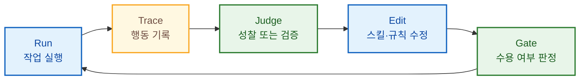
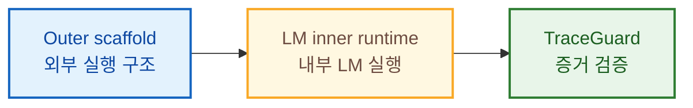
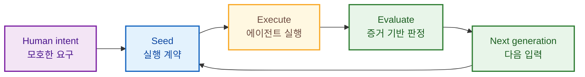

2026년 8월 1일, [인프랩(Inflab)](https://story.inflab.com/) 사옥에서 열린 **Inflab AXPORT 빌더밋**에 다녀왔습니다. 이날 발표는 요즘 가장 핫한 오픈소스, 우로보로스(Ouroboros)의 개발자이신 이재규 님의 **"Ouroboros 빌더밋 - 하네스, 에이전트에게 건네는 계약서"**였습니다. 제목에 들어간 하네스(harness)부터 요즘 AI 개발 현장에서 꽤 자주 듣지만, 막상 한 문장으로 설명해 보려면 손이 잠깐 멈추는 단어입니다.

한창 AI를 배우는 중인 개발자로서 아직도 못 알아듣겠는 용어가 마구 쏟아져 나왔는데요, 발표를 따라가고 이해하고 메모를 적느라 꽤 바빴던 것 같네요.

그래도 메모 전체를 관통하는 질문은 또렷했습니다.

> 우리는 에이전트에게 어디까지 일을 맡길 수 있으며, 그 결과를 무엇으로 믿을 수 있을까요?

발표는 이 질문에 더 좋은 프롬프트를 쓰는 방법으로 답하지 않았습니다. 대신 **상태, 검증, 권한, 재현을 담은 계약**, 그리고 그 계약을 반복해서 실행하는 **루프**를 이야기했습니다. 이번 글에서는 발표를 들으며 인상 깊었던 내용을 제 나름대로 다시 정리해 보겠습니다.


## 이재규 님이 우로보로스 발표를 준비하신 방법

재규님은 먼저 발표 초안을 준비한 뒤, 행사 전 설문에서 받은 피드백을 바탕으로 발표를 처음부터 다시 구성하셨다고 합니다. 사전 설문에서는 가장 듣고 싶은 이야기를 적는 부분이 있었는데요, 가장 많이 나온 주제 다섯가지를 뽑아서 발표를 다시 만든 것이죠. 그 다섯 주제는 아래와 같았습니다:

1. 다들 하네스를 어떻게 쓰고 계신가요?
2. 어디까지 믿고 맡기는지? - 검증, 평가 루프
3. 품질과 토큰 트레이드오프
4. 모델이 좋아지면 하네스는 버려질까요?
5. 우로보로스의 탄생비화

발표 자료를 만드는 작업은 모두 ooo와 함께 진행하셨다고 합니다. 프롬프트에 [LaTeX](https://www.latex-project.org/)를 활용하니 원하는 형식의 발표 문서로 출력하기 좋았다는 팁도 덧붙이셨습니다.

## "Token maxing is dead"

발표 초반부터 사뭇 도발적인 문장이 등장했습니다. 하지만 ooo(Ouroboros, 이하 ooo)의 컨셉을 생각하면 예상할 수 있는 전제입니다.

> Token maxing is dead. Say hello to frugality.

예전에는 토큰 맥싱(Token maxing)이 대세로 인정받았습니다. 토큰을 더 많이 써서 성과를 내는 것이 결과적으로 비용 절감으로 이어진다는 분석과 믿음이 있었습니다. 그런데 이제는 좋은 결과를 얻기 위해 더 긴 컨텍스트와 더 많은 추론 토큰을 밀어 넣던 시대가 저물고 있다는 이야기입니다. 모델과 도구가 허용하는 사용량에는 한계가 있고, 에이전트가 긴 작업을 반복할수록 비용도 무시하기 어려워집니다. 결국 "얼마나 많은 토큰을 썼는가"가 아니라 **같은 성과를 얼마나 적은 토큰으로 만들었는가**가 중요해집니다.

발표에서는 이를 **성과당 비용(Reward per Cost, RpC)**이라는 공식으로 설명했습니다.

```text
RpC = pass(0 또는 1) / 사용 토큰 수 × 1,000
```

예전의 서버 성능 논쟁은 처리량과 지연 시간 같은 숫자로 비교적 빨리 끝낼 수 있었습니다. 반면 지금의 에이전트 하네스는 각자의 `taste`, 그러니까 취향과 감각으로 평가되는 경우가 많습니다. 감이 나쁘다는 이야기는 아닙니다. 다만 수치로 남지 않는 감은 다음 버전이 정말 나아졌는지, 얼마나 나아졌는지 설명하기 어렵죠.

이 관점으로 보면 앞으로 개발 일정에 관한 질문도 조금 달라질 수 있습니다.

* 이전: "이 작업은 며칠 정도 걸릴까요?"
* 앞으로: "이 작업을 통과시키는 데 토큰이 얼마나 들까요?"

사람의 시간을 토큰 가격표 하나로 바꿀 수는 없을지도 모릅니다. 다만 에이전트가 실제 작업량의 큰 부분을 맡게 된다면, **시간과 함께 토큰 예산을 추정하고 관리하는 능력**이 새로운 엔지니어링 지표가 될 수 있겠다는 생각이 들었습니다.

## 프롬프트에는 없고 하네스에는 있는 네 가지

그렇다면 프롬프트와 하네스의 차이는 무엇일까요? 발표에서는 프롬프트만으로 채우기 어려운 네 가지를 짚었습니다.

| 구분 | 하네스가 답해야 하는 질문 |
| ---: | --- |
| **상태(State)** | 이전 실행에서 무엇이 일어났고, 지금 어디까지 진행됐는가? |
| **검증(Verification)** | 결과가 요구사항을 충족했다는 사실을 무엇으로 증명하는가? |
| **권한(Permission)** | 에이전트가 무엇을 읽고, 바꾸고, 실행할 수 있는가? |
| **재현(Reproduction)** | 같은 조건에서 실행을 다시 추적하거나 재현할 수 있는가? |

프롬프트가 에이전트에게 건네는 **업무 요청서**라면, 하네스는 업무 범위와 검사 기준, 권한, 기록 방법까지 포함한 **계약서**에 더 가깝습니다. 적절한 하네스는 프롬프트를 두껍게 포장하는 것이 아니라, 프롬프트에 없는 이 네 가지 공백을 메워야 합니다.

여기서 특히 인상 깊었던 지점은 **하네스의 역할을 하나만 고르라면 비결정적인 꼼수와 보상 해킹(reward hacking)을 막는 것**이라는 설명이었습니다. 점수만 높이면 되는 에이전트는 어떤 시점에서 우리가 의도한 문제를 풀지 않고, 채점기의 빈틈을 뚫고 점수를 받는 가짜 결과를 제출합니다. 정말 공감이 되는 내용이죠.

논쟁의 진짜 축은 스킬 문서가 두꺼운지 얇은지가 아닙니다. 더 중요한 질문은 이것입니다.

> 우리가 합의한 설계 기준이 코드로 강제되고 있는가?

### 검증 모델이 잘 검증했는지를 알려면? - AI 검증 무한 재귀의 역설

에이전트의 결과를 검증하려면 어떻게 할까요? 검증만을 전담하는 서브에이전트를 두는 방법을 먼저 생각해 볼 수 있죠. 그럼 그 서브에이전트는 누가 어떻게 검증할까요? 또 다른 검증 서브에이전트를 두고, AI를 검증하는 AI를 검증하는 AI를 검증하는 식으로 이어질 뿐입니다.

이 무한 재귀를 끊기 위해 발표에서 제시한 출발점은 **로그를 남기는 것**입니다.

[Langfuse](https://langfuse.com/docs/observability/overview) 같은 관측 도구는 프롬프트와 응답뿐 아니라 토큰 사용량, 지연 시간, 도구 호출과 검색 단계까지 하나의 trace로 기록합니다. 에이전트가 최종 답만 멋지게 포장하더라도, 어떤 도구를 어떤 순서로 호출했고 그 과정에서 무슨 일이 벌어졌는지 trace를 보면 판단할 근거가 생깁니다.

발표에서 설명한 자기개선 루프를 제가 이해한 형태로 옮기면 다음과 같습니다.



Judge가 trace를 읽고 다음 시도에 반영하면 **성찰(reflect)**이고, trace가 정해진 계약을 지켰는지 판정하면 **검증(verify)**입니다. 발표를 들을 때는 모르는 용어가 많이 나와 어려웠는데, 나름대로 찾아 정리해 보았습니다.

* **[GEPA](https://arxiv.org/abs/2507.19457)**: Genetic-Pareto의 약자로, AI 시스템이 만든 추론과 도구 호출 등의 실행 궤적을 자연어로 성찰하고 실패 원인을 진단한 뒤 프롬프트 수정안을 만들고 시험하는 최적화 방식입니다. 숫자 하나로만 보상하기보다 실행 과정에서 얻은 언어 피드백을 다음 세대의 프롬프트에 반영합니다.
* **[VPRM](https://arxiv.org/abs/2601.17223)**: Verifiable Process Reward Model의 약자입니다. 최종 답만 맞았는지 채점하는 대신, 중간 추론의 각 단계가 명시된 규칙을 지켰는지 결정론적 검사기로 확인해 보상을 줍니다. 논문에서는 의료 문헌의 비뚤림 위험 평가를 사례로 들어, 신경망 Judge의 불투명성과 보상 해킹을 줄이는 방법을 제안합니다.
* **[Hermes Agent](https://hermes-agent.nousresearch.com/docs/)**: Nous Research가 만든 자기개선형 에이전트입니다. 작업 경험에서 메모리와 스킬을 만들고, 사용 중에 스킬을 개선하며, 다음 세션에서도 그 기록을 다시 활용하는 닫힌 학습 루프를 지향합니다. 여기서는 단일 평가 기법의 이름이라기보다, 실행 경험을 축적해 스스로 작업 방식을 바꾸는 에이전트 사례로 이해했습니다.
* **[SkillOpt](https://github.com/microsoft/SkillOpt)**: 모델 가중치를 바꾸지 않고 자연어 스킬 문서를 학습 대상으로 삼는 최적화 도구입니다. 에이전트의 rollout을 관찰해 제한된 수정안을 만들고, 별도의 검증 데이터와 validation gate를 통과한 버전만 남겨 최종 `best_skill.md`로 내보냅니다. 사람이 직접 스킬을 계속 깎는 일을 반복 가능한 학습 루프로 옮긴 셈입니다.

## LLM은 제안하고, 인간은 경계를 만들고, 오라클은 판정한다

이날 발표에서 임팩트 있게 다가온 문장 중에 하나로 저는 이것을 고르고 싶네요.

> LLM은 제안한다. 인간의 의도가 경계를 만든다. 오라클이 판정한다.

세 역할 중 하나라도 빠지면 에이전트 시스템은 균형을 잃습니다.

* **LLM이 없으면** 에이전트가 아니죠.
* **인간이 없으면** 무엇이 옳은지 정할 의도와 권위가 사라집니다.
* **오라클이 판정하지 않으면** 조직은 결과를 믿고 실제 업무를 맡기기 어렵습니다.

발표를 들을 때는 오라클이 무엇인지 바로 이해하지 못했습니다. 오라클이 설마 그 ["오라클"](https://www.oracle.com/)은 아니었겠죠. 찾아보니, 소프트웨어 테스트에서 오라클은 입력에 대해 기대하는 정답이나 결과를 알려주는 판정 기준을 뜻하더라고요. AI 에이전트에서도 테스트, 타입 검사, 정책 코드, 스키마 검증처럼 결과가 계약을 지켰는지 외부에서 판정하는 기준을 오라클로 볼 수 있습니다.

발표에서 소개된 [TraceGuard](https://github.com/Q00/rlm-forge)는 에이전트가 만든 사실과 이를 뒷받침하는 실행 증거를 연결하고, 현재 실행의 증거로 뒷받침되지 않은 주장을 통과시키지 않는 결정론적 검증 장치입니다. 기본 태도도 이와 닿아 있었습니다.

* AI가 아닌 코드로 검사해 반복 가능하게 만들기
* 값싼 검사를 먼저 실행해 빠르게 실패시키기
* 애매하면 허용하지 않고, 증거가 없으면 탈락시키기

이른바 **fail closed** 방식입니다. 비슷한 용어로 느껴지는 fail-fast가 오류를 발견하는 즉시 실행을 중단해 문제를 빨리 드러내는 전략이라면, fail-closed는 판정이 불확실하거나 검증이 실패했을 때 접근이나 승인을 거부하는 안전한 기본값이라는 차이가 있습니다. 에이전트의 자신감이나 유창한 설명을 증거로 취급하지 않고, 계약이 요구한 흔적이 실제 trace에 남아 있는지를 보는 것이죠. 저는 이것이 단순한 안전장치를 넘어, 조직이 에이전트에게 일을 건넬 수 있게 만드는 최소한의 신뢰 장치라고 느꼈습니다.

## 긴 컨텍스트를 이기는 방법은 더 크게 넣는 것이 아닐 수 있다

더 많이 읽히면 더 잘할 것 같지만, 컨텍스트가 길어질수록 모델이 그 안의 정보를 고르게 활용하지 못하는 문제도 생깁니다. 이 사실은 저도 미리 알고 있었는데요, 컨텍스트가 너무 길면 AI가 앞선 정보를 잊어먹거든요. 그래서 저도 스킬 하네스나 프롬프트를 최대한 간결하게 작성하는 습관을 갖고 있어요.

[RLM(Recursive Language Models)](https://arxiv.org/abs/2512.24601)은 이 문제를 모델 자체보다 **실행 구조**의 문제로 바라봅니다. 긴 입력 전체를 한 번에 모델 안으로 밀어 넣는 대신 외부 환경에 두고, 모델이 필요한 부분을 프로그래밍 방식으로 살피고 나누며 작은 LM 호출을 재귀적으로 수행합니다.

발표의 표현을 빌려 단순화하면 다음과 같은 구조입니다.



즉, **쪼개면 품질과 토큰을 둘 다 잡을 수 있다**는 발상입니다. 물론 무작정 잘게 나눈다고 문제가 해결되는 것은 아닙니다. 무엇을 나누고, 어느 조각을 다시 읽고, 언제 멈출지를 외부 실행 구조가 관리해야 합니다. RLM은 새로운 모델 이름이 아니고, 이러한 실행 구조를 가리킨다고 하시더라고요.

## 모델이 좋아지면 하네스는 사라질까

모델이 계속 좋아지면 정교하게 깎아 만든 스킬이나 하네스의 가치가 떨어지지 않을까요? 재규님은 오히려 **개인이 만든 하네스가 경계를 만들고, 상위 레이어의 Agent OS가 그 발전의 수혜를 받는다**고 보았습니다.

물론 이 부분에 앞서 재규님은 "이제 스킬을 깎는 시대는 가고 루프 엔지니어링의 시대가 오고 있다. 직접 스킬을 깎으려고 하지 마라. 스킬은 루프 안에서 자연스럽게 스스로 진화한다"고도 말씀하셨습니다. 하지만 그게 하네스가 필요 없어진다는 뜻은 아니었죠.

Claude Code나 Codex 같은 실행 하네스가 더 강력해져도, 그 위에서 어떤 의도를 계약으로 만들고 어떤 정책과 기록 체계로 여러 실행기를 묶을지는 여전히 남습니다. [Ouroboros](https://github.com/Q00/ouroboros)가 스스로를 단순한 하네스보다 **Agent OS**라고 설명하는 이유도 여기에 있습니다. 공식 저장소의 구조 역시 모호한 요구를 인터뷰로 구체화하고, 불변의 Seed 명세로 만든 뒤 실행과 평가 결과를 다음 세대 입력으로 되돌리는 루프로 설명됩니다.



이런 구조에서는 모델이 좋아질수록 OS가 사용할 수 있는 실행기의 성능도 함께 좋아집니다. 특정 모델의 약점을 메우느라 두꺼워진 스킬은 얇아질 수 있어도, **상태와 권한, 검증과 재현을 책임지는 계약 계층**은 쉽게 사라지지 않습니다.

불과 몇 달 전까지, Garry Tan의 ["Thin Harness, Fat Skills"](https://github.com/garrytan/gbrain/blob/master/docs/ethos/THIN_HARNESS_FAT_SKILLS.md)라는 말씀이 널리 퍼졌었는데요, 재규님은 thin skill이 이제 맞는 방향인 것 같다는 의견을 주셨습니다. 그리고 [Matt Pocock](https://github.com/mattpocock/skills)을 언급하셨는데요, 이분의 스킬은 정말 유명한데 특히 [`grill-me`](https://github.com/mattpocock/skills/blob/main/skills/productivity/grill-me/SKILL.md)가 유명하죠. 관심 있으신 분은 그의 깃허브 스킬 저장소를 방문해 보시는 것도 좋겠습니다. 재규님은 이분의 스킬을 직접 깎는 접근이 비록 loop engineering 스타일에는 맞지 않지만, 스킬 내부를 들여다보면 굉장히 컴팩트한 점을 사례로 들며 긍정적으로 평가하셨습니다.

## 자기개선은 조용한 변이가 아니라 검토 가능한 기록이어야 한다

발표 뒤에 따로 찾아본 `dreaming`이라는 키워드도 같은 방향을 가리키고 있었습니다. [Hermes Dreaming](https://www.hermesbible.com/flows/hermes-dreaming-reviewable-self-improvement)은 에이전트가 자기 상태를 몰래 고쳐버리는 대신, 변경 제안을 artifact로 만들고 diff, validate, apply, discard 단계를 거치게 합니다.

이 관점에서 중요한 것은 에이전트가 스스로 개선되었다고 말하는 일이 아닙니다.

* 무엇을 보고 변경을 제안했는가?
* 어떤 파일과 규칙이 달라지는가?
* 변경 전후 차이를 사람이 검토할 수 있는가?
* 검증에 실패하면 안전하게 버릴 수 있는가?

결국 자기개선도 하나의 특별한 마법이 아니라, **증거와 승인 단계를 가진 변경 관리**가 되어야 한다는 것이겠죠.

## 발표장을 나오며: 네트워킹은 좀 아쉬워

이재규 님의 발표가 끝나고 Q&A와 네트워킹 시간이 이어졌습니다. 인프랩 CTO 향로님을 먼발치에서 직접 뵐 수 있어서 신기했는데요. 약간 연예인을 보는 기분이었습니다. 전에 자바 스프링 강사로 일하면서 만났던 반가운 분들을 인프랩에서 우연찮게 다시 뵐 수 있어서 너무 좋았습니다.

네트워킹 시간에는 AI 분야에서 서로 아는 분들이 많이 방문했다는 것도 느낄 수 있었습니다. 반면 저는 아는 분이 거의 없어서 대화에 끼기가 쉽지 않더군요. 한동안 뻘쭘하게 있다가 그냥 돌아갔습니다. 네트워킹 시간을 알차게 활용하지 못한 것 같아 조금 아쉬웠네요.

## 결론: 프롬프트가 아니라 계약을 남기세요

이번 이재규님의 우로보로스 발표 핵심 주제를 다시금 요약해 봅니다:

* 좋은 하네스는 상태, 검증, 권한, 재현이라는 프롬프트의 빈칸을 채웁니다.
* 에이전트의 최종 답보다 실행 trace와 결정론적 증거를 먼저 봐야 합니다.
* 자기개선은 `run -> trace -> judge -> edit -> gate`의 닫힌 루프로 관리해야 합니다.
* 모델이 좋아져도 인간의 의도와 오라클의 판정을 연결하는 계약 계층은 남습니다.
* 앞으로는 작업 시간뿐 아니라 통과한 결과 하나를 만드는 토큰 비용도 중요한 지표가 될 수 있습니다.

루프 엔지니어링과 관련 개념을 많이 듣고 올 수 있어서 유익한 시간이었네요. 실습이나 데모를 볼 수 있었더라면 더 와닿고 좋았을걸 하는 아쉬움은 남습니다.

## Reference

* [https://ouroboros.page/](https://ouroboros.page/)
* [https://github.com/Q00/ouroboros](https://github.com/Q00/ouroboros)
* [https://github.com/Q00/rlm-forge](https://github.com/Q00/rlm-forge)
* [https://story.inflab.com/](https://story.inflab.com/)
* [https://www.latex-project.org/](https://www.latex-project.org/)
* [https://langfuse.com/docs/observability/overview](https://langfuse.com/docs/observability/overview)
* [https://arxiv.org/abs/2507.19457](https://arxiv.org/abs/2507.19457)
* [https://arxiv.org/abs/2601.17223](https://arxiv.org/abs/2601.17223)
* [https://arxiv.org/abs/2512.24601](https://arxiv.org/abs/2512.24601)
* [https://github.com/microsoft/SkillOpt](https://github.com/microsoft/SkillOpt)
* [https://hermes-agent.nousresearch.com/docs/](https://hermes-agent.nousresearch.com/docs/)
* [https://www.hermesbible.com/flows/hermes-dreaming-reviewable-self-improvement](https://www.hermesbible.com/flows/hermes-dreaming-reviewable-self-improvement)
* [https://csrc.nist.gov/projects/automated-combinatorial-testing-for-software/automated-test-generation-using-model-checking](https://csrc.nist.gov/projects/automated-combinatorial-testing-for-software/automated-test-generation-using-model-checking)
* [https://owasp.org/www-community/Fail_securely](https://owasp.org/www-community/Fail_securely)
* [https://github.com/garrytan/gbrain/blob/master/docs/ethos/THIN_HARNESS_FAT_SKILLS.md](https://github.com/garrytan/gbrain/blob/master/docs/ethos/THIN_HARNESS_FAT_SKILLS.md)
* [https://github.com/mattpocock/skills](https://github.com/mattpocock/skills)
